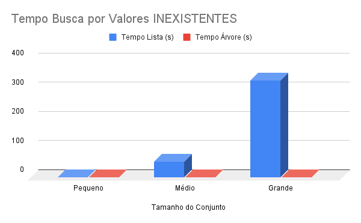
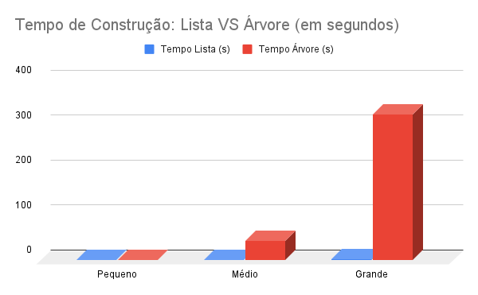

# Análise de Desempenho: Lista vs. Árvore Binária de Busca

> Um estudo comparativo sobre eficiência algorítmica focado em tempo de construção e busca.

 

## 📋 Sobre o Projeto

Este projeto foi desenvolvido como parte do curso de Análise e Desenvolvimento de Sistemas. O objetivo principal foi comparar, na prática, a eficiência entre duas estruturas de dados fundamentais: **Listas Sequenciais** e **Árvores Binárias de Busca (BST)**.

O experimento analisa o comportamento de ambas as estruturas em diferentes escalas (de 100 a 30 milhões de registros) e cenários (busca de valores existentes vs. inexistentes).

📄 **[Leia o Relatório Completo (PDF)](docs/Relatorio%20Completo.pdf)** para ver a fundamentação teórica detalhada e todos os gráficos gerados.

## 📊 Principais Resultados

A análise foi dividida em três cenários críticos: o momento da virada de eficiência, o comportamento em larga escala (Big Data) e a tentativa de otimização da estrutura linear.

### 1. O "Ponto de Virada" (Eficiência Imediata)
Analisando o tempo total (Construção + Busca), a Árvore supera a Lista linear surpreendentemente rápido, apesar do seu custo inicial de inserção mais alto.

* **Busca por Inexistentes:** A Árvore vence a partir de **N = 120** elementos.
* **Busca por Existentes:** A Árvore vence a partir de **N = 250** elementos.

### 2. Cenário "Big Data" (30 Milhões de Registros)
Em grandes volumes, a busca linear da Lista se tornou inviável, enquanto a Árvore manteve performance constante.

| Estrutura | Tempo de Construção | Tempo de Busca (Inexistente) | Conclusão |
| :--- | :--- | :--- | :--- |
| **Lista Sequencial** | ~2.1s (Rápida) | **~333.25s** (Crítico) ⚠️ | Inutilizável para leitura frequente. |
| **Árvore Binária** | ~323.6s (Lenta) | **~0.0008s** (Instantânea)  | Ideal para bases de leitura intensiva. |

> **Insight:** Para garantir que um valor *não existe* na Lista, o algoritmo precisou percorrer todos os 30 milhões de itens, gerando o gargalo de 333 segundos. A Árvore resolveu o mesmo problema em milissegundos.

#### 📉 Evidência Visual (Gráficos)
O contraste de performance fica evidente nos gráficos abaixo. Note a barra azul (Lista) **estourando o tempo de busca** à esquerda, enquanto à direita, a barra vermelha (Árvore) evidencia o **alto custo inicial** de sua construção.

<div align="center">
  
  
</div>

### 3. Engenharia de Otimização (Merge Sort + Binary Search)
Para mitigar a lentidão da lista, foi implementada uma **Lista Otimizada** utilizando ordenação via *Merge Sort* e *Busca Binária*.

* **Resultado:** O tempo de busca no conjunto grande caiu de **333s** (Lista Comum) para **~0.003s** (Lista Otimizada).
* **Trade-off:** O tempo de preparação subiu para ~200s (devido à ordenação), mas provou ser uma alternativa viável à Árvore em cenários onde a estrutura de memória deve permanecer linear.

## 📂 Estrutura do Repositório

```text
.
├── docs/
│   └── Relatorio Completo.pdf  # Análise detalhada, gráficos e tabelas
├── assets/                     # Imagens e gráficos gerados (opcional)
├── main.py                     # Script principal de teste e benchmarking
├── gerar_conjuntos.py          # Utilitário para gerar os datasets de teste
└── README.md